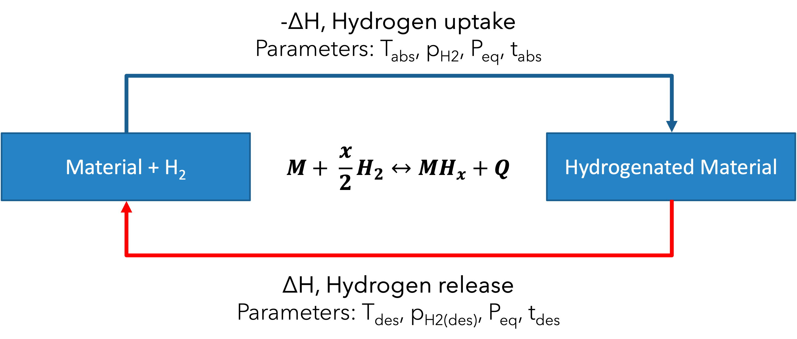
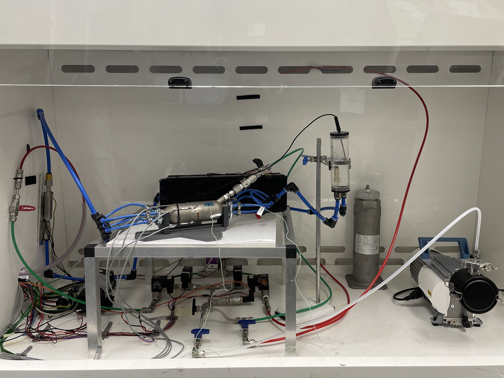

# HyCYCLE-Project
This repository contains all the workflow performed in the development of a hydrogen storage testing rig, from the PID, to the reactor rig control and its data analysis according to the specific parameters of the experiments.

## Rig and Reactor Purposes
A small Hydrogen Storage Reactor (HSR) to rapidly ‘cycle’ between absorption and desorption, to study the effect of the cycling condtions on the storage material (metal hydride) and its lifetime. The additional vacuum pump is implemented to further push the activation of certain class of materials.

## Hydrogen Storage Reaction with Metal Hydrides
Hydrogen storage using metal hydrides involves the reversible chemical reaction between hydrogen gas (H₂) and a metal or alloy to form a metal hydride (MHₓ). This process can be represented by the equation:
<p align="center">
  
</p>
Key parameters influencing this reaction include:

- Temperature: The absorption and desorption of hydrogen by the metal hydride are temperature-dependent. Higher temperatures typically favor desorption, while lower temperatures favor absorption.

- Pressure: Hydrogen storage capacity and kinetics are also influenced by the hydrogen gas pressure. Higher pressures generally enhance hydrogen uptake.

- Thermodynamics: Enthalpy and entropy changes during the reaction determine the equilibrium conditions.

- Kinetics: The reaction rates for hydrogen absorption and desorption depend on the metal's properties and surface characteristics.

- Material Properties: The choice of metal or alloy affects storage capacity, reversibility, and cycling stability. 

## PID and Rig Building
The rig was built with the use of 4 solenoid valves (SV) and a mass flow controller (MFC) to allow a flow of hydrogen from a main gas line to the reactor and from the reactor to an outlet. The basics function and the OpModes are described in details in the attached PID. The additional vacuum pump is connected through a manual three-way valve system (BV1). To monitor the pressure during operations, a digital pressure transducer has been installed (PT). Additional levels of safety operations were implemented with the installation of a manual venting and manual vacuum operations which were controlled by shut off valves or ball valves (BV). The PID's right hand side shows the heating management system with a cooling fan (for exothermic operations) and heater (for endothermic operations).
<p align="center">
  
  
</p>

# Control Code
Four python files are necessary (they can be found in the folder Rig_Controller):

1. DaqCh0to7Bridge.py
2. bronkhorst.py
3. ISAK2.py
4. SmallReactor_Main.py

## 1. DaqCh0to7Bridge.py Documentation
This Python script is designed to interface with a National Instruments (NI) Data Acquisition (DAQ) system to read strain measurements from multiple sensors and publish the results via MQTT. The script is designed to manage and monitor strain gauges used in a variety of experimental or monitoring setups, making it useful for real-time data acquisition and analysis in engineering and research applications.

**Key Features:**
- Initialization: Defines initial strain values for different channels on three DAQ modules.

- MQTT Setup: Configures an MQTT client to handle subscription and message publishing for data transfer.

- DAQ Configuration: Sets up multiple DAQ tasks to read strain gauge values from various channels.

- Reading and Publishing Data: Reads strain values from the DAQ channels, publishes them to specific MQTT topics, and prints the results to the console.

- Exception Handling: Includes error handling for DAQ readings and prints exceptions if enabled.

- Cleanup: Registers a function to close all DAQ tasks gracefully upon script termination.

## 2. bronkhorst.py Documentation
This code is a Python driver for Bronkhorst flow controllers, which are devices used to control and measure gas flow. The code includes a class Bronkhorst that provides methods to communicate with the device via a serial port, send commands, and read various parameters such as setpoint, flow, and device information.

**1. Import Statements:**

- Imports necessary libraries such as time, sys, and serial.

- The from __future__ import print_function ensures compatibility between Python 2 and Python 3 for the print function.

**2. Class Definition (Bronkhorst):**

- Initialization (`__init__` method): Initializes the serial connection to the flow controller and verifies the connection.

- Communication Method (`comm` method): Sends a command to the device and receives the reply.

- Read Setpoint (`read_setpoint` method): Reads the current setpoint value from the device.

- Read Flow (`read_flow` method): Reads the actual flow value from the device.

- Set Flow (`set_flow` method): Sets a desired flow setpoint on the device.

- Read Counter Value (`read_counter_value` method): Reads the valve counter value (not fully implemented).

- Set Control Mode (`set_control_mode` method): Sets the control mode to accept RS232 setpoints.

- Read Serial (`read_serial` method): Reads the serial number of the device.

- Read Unit (`read_unit` method): Reads the flow unit from the device.

- Read Capacity (`read_capacity` method): Reads the capacity from the device (the exact meaning is unclear).

If the script is run directly, it creates an instance of the Bronkhorst class and calls various methods to interact with the device.

## 2. ISAK2.py Documentation
This code provides a set of functions primarily designed for handling data from CAN (Controller Area Network) frames and Modbus communication, as well as some utility functions for reading and writing configuration files and mapping values. The functions cover decoding and reassembling CAN data, converting between data formats, and interacting with devices over Modbus.

**1. Data Decoding Functions:**

- `CanDecode4ByteIntelLittleEnd(InputVal, ScalerVal)`: Decodes a 4-byte integer from Intel little-endian format, scales it by a given value, and returns the scaled output.

- `CanDecode4ByteMotorolaBigEnd(InputVal, ScalerVal)`: Decodes a 4-byte integer from Motorola big-endian format, scales it by a given value, and returns the scaled output.

**2. Hexadecimal Data Handling:**

- `CanRxHexRecompile(InputVal)`: Converts an integer input value to a hexadecimal string.

- `ExtractRawHexDataFromCanFrame(RawHexData, startbytepos, endbytepos)`: Extracts a portion of raw hexadecimal data from a specified start and end byte position.

**3. IEEE Floating Point Conversion:**

- `IeeeFloatManualReassembleFromCan(Byte1, Byte2, Byte3, Byte4)`: Reassembles a float from four bytes in IEEE 754 format.

- `CanTx32BitHexAssemble(InputVal)`: Assembles a 32-bit float into a hexadecimal byte array.

**4. Modbus Communication:**

- `EnapterEl20ModbusRx(ModbusDevice, MbReg, Sz, CovnLsb)`: Reads data from a Modbus device, supports 16-bit and 32-bit data sizes.

- `EnapterEl20ModbusTx(ModbusDevice, MbCoil, WriteVal)`: Writes a value to a Modbus coil.

- `EnapterEl21ModbusRx(ModbusDevice, MbReg, typ)`: Reads data from a Modbus device, supports various data types (bool, uint16, uint32, uint64, float32).

**5. Legacy Configuration File Handling:**

- `LegacyFormatGetLineVal(filehandle, optiontag)`: Reads a value associated with a given option tag from a legacy configuration file.
- `LegacyFormatSetLineVal(filehandle, optiontag, newval)`: Sets a new value for a given option tag in a legacy configuration file.

**6. Utility Function:**

- `ArduinoLikeMapFunction(ValToMap, InputMin, InputMax, OutputMin, OutputMax)`: Maps a value from one range to another, similar to the map() function in Arduino.

## 4. SmallReactor_Main.py Documentation

**Libraries Used:**

1. **nidaqmx**: This library is used for interacting with National Instruments Data Acquisition (NI-DAQ) devices. It provides functions for configuring and controlling DAQ hardware, as well as reading and writing data.
2. **serial**: The **`serial`** library is used for serial communication. It allows the Python script to communicate with serial devices, such as microcontrollers, sensors, and other hardware components, via a serial port (e.g., RS-232, RS-485, USB).
3. **bronkhorst**: This library provides functions for interacting with Bronkhorst mass flow controllers. It likely includes methods for controlling flow rates and reading data from the mass flow controller.
4. **datetime**: This library is used for handling dates and times in Python. It provides classes and functions for working with dates, times, and time intervals.
5. **time**: The **`time`** module provides various time-related functions, such as sleeping (pausing execution for a specified duration), measuring time intervals, and getting the current time.
6. **paho.mqtt.client**: This library implements the MQTT protocol for Python. It allows the Python script to act as an MQTT client, enabling it to publish messages to MQTT brokers and subscribe to topics to receive messages from other clients or devices.
7. **queue**: The **`queue`** module provides thread-safe data structures for implementing queues. In this code, it's used to store data received via MQTT messages, ensuring safe access from multiple threads.
8. **pymodbus.client**: This library provides a Modbus TCP client implementation in Python. Modbus is a communication protocol commonly used in industrial automation systems for communicating with PLCs, sensors, and other devices.

**Communication Methods:**

- **Serial Communication**: The code communicates with an Arduino (ArdSerial) using the **`serial`** library. It sends commands and receives data over a serial connection to control the Arduino and retrieve sensor data.
- **NI-DAQ Communication**: Communication with NI-DAQ devices (e.g., data acquisition boards) is facilitated using the **`nidaqmx`** library. This allows the Python script to configure and control DAQ hardware and read data from analog input channels.
- **MQTT Communication**: The code uses MQTT (Message Queuing Telemetry Transport) for communication with other devices or systems. It acts as an MQTT client, subscribing to specific topics to receive data and publishing data to other topics.
- **Modbus TCP Communication**: The **`pymodbus.client`** library enables the Python script to communicate with devices supporting the Modbus TCP protocol over Ethernet. It's used for reading data from Modbus-compatible devices.

**Code Structure:**

1. **Importing Libraries**: The code begins by importing the required Python libraries, including those for communication (serial, MQTT, Modbus), data acquisition (nidaqmx), and datetime handling.
2. **Initialization**: This section initializes necessary components such as MQTT client, queues for storing data received via MQTT, and configuration settings.
3. **Function Definitions**: The code defines several functions for specific tasks, such as mapping values, handling MQTT events (connection, message), stopping flow, sampling data, and printing data.
4. **Main Loop or Execution Logic**: The main execution logic typically involves continuous sampling of data, processing it, and performing actions based on the received data. This may include interacting with hardware (e.g., controlling flow rates), publishing data via MQTT, and logging data to a file or database.
5. **Data Processing and Communication**: Within the main loop or execution logic, the code samples data from various sources (e.g., DAQ, sensors), processes it (e.g., calculating flow rates, volumes), and communicates with other devices or systems (e.g., publishing data via MQTT, sending commands to Arduino).
6. **Error Handling**: The code may include error handling mechanisms, such as try-except blocks, to handle exceptions gracefully and ensure the robustness of the system.
7.  **Strain Limits**: The code will break the main loop if one of the strain sensor hits the upper limit. This allows the abruption of operations avoiding catastrophic failure of the system


# Data Analysis Code

## Files information
### Data Source

| Generic Filename | YYYYMMDDhhmmss_IDENTIFIER.txt |
| --- | --- |
| Example | 20231027151332_RRC2.txt |
| Structure | Timestamp (YYYYMMDDhhmmss)
IDENTIFIER (RRC2) |

### File Structure

**Introductory Lines**

1. Log Start Identifier: RRC2 log start
2. Pump Flow Rate: Pump Flow Rate: 3
3. Test Parameters: Absorption flow rate: 5L/min, Desorption flow rate: 3L/min, Absorption test time: 1500sec, Desorption test time: 3000sec, Total cycles: 2

| Line No. | Information | Example |
| --- | --- | --- |
| 1 | Log Start Identifier | RRC2 log start |
| 2 | - | - |
| 3 | Pump Flow Rate | Pump Flow Rate: 3 |
| 4 | Test Parameters | Absorption flow rate: 5L/min, Desorption flow rate: 3L/min, Absorption test time: 1500sec, Desorption test time: 3000sec, Total cycles: 2 |

### Dataset

| Column | Data Type | Description |
| --- | --- | --- |
| t | datetime | Timestamp YYYY-MM-DD HH:MM:SS.ffffff |
| Strain9 | float | Strain gauge reading 9 |
| Strain10 | float | Strain gauge reading 10 |
| H2flowrate | float | Hydrogen flow rate |
| Temp1 | float | Temperature reading 1 |
| Temp2 | float | Temperature reading 2 |
| Pressure | float | Pressure reading |
| H2_transferred_cumulative | float | Cumulative hydrogen transferred |

**Metadata and Section Markers**: Before each set of data, there are markers indicating the start and end of specific testing phases, such as:

- ***Start absorption 1***
- ***Complete absorption 1***
- ***Start desorption 1***
- ***Complete desorption 1***
- etc.

### File Example

```jsx
RRC2 log start
Pump Flow Rate: 3

Absorption flow rate: 5L/min, Desorption flow rate: 3L/min, Absorption test time: 1500sec, Desorption test time: 3000sec, Total cycles: 2
t, Strain9, Strain10, H2flowrate, Temp1, Temp2, Pressure, H2_transferred_cumulative
***Start absorption 1***
2023-10-27 16:28:37.187173,0x0F,0x0F,0.024843749999999998,28.36,55.31,55.47,63.11,0.04,0.0
2023-10-27 16:28:37.699181,0x0F,0x0F,0.023906249999999997,28.34,55.23,55.38,63.06,0.04,0.0
...
***Complete absorption 1***
***Start desorption 1***
...
***Complete desorption 1***
***Start absorption 2***
...
```

### Variations

Typically, the raw files “YYYYMMDDhhmmss_IDENTIFIER.txt” are logging the data of 12 cycles maximum. However, in the case one experiment is run for more than 12 cycles (and often it is a multiple of 12), the data are saved in multiple text files with the same generic filename “YYYYMMDDhhmmss_IDENTIFIER.txt” (where the timestamp is the one of the 1/12 cycles of the experiment) and a file “YYYYMMDDhhmmss_IDENTIFIER-AllLogs.txt”, which contains all the set of data for every cycle.

## Data Analysis 

The code processes and analyzes data from text files located in two specified directories. It performs the following main tasks:

1. **Reading and Combining Data**: Reads text files from two folders, combines the data into two large DataFrames, and renames columns appropriately.
2. **Cleaning and Filtering Data**: Cleans and filters the combined data, extracting and converting relevant columns into numeric formats.
3. **Calculating Additional Metrics**: Computes additional metrics such as time since the start of each cycle, time since the start of each experiment, and the total amount of hydrogen (H2) stored.
4. **Generating Summary Statistics**: Aggregates data to provide summary statistics for various metrics grouped by cycle number and experiment type.
5. **Plotting Data**: Generates various plots to visualize the hydrogen storage, flow rates, pressure, and strain over time.

### Detailed Steps

1. **Setup and Imports**:
    - Imports necessary libraries (`os`, `numpy`, `pandas`, `regex`, and `matplotlib`).
2. **Define File Paths and Keywords**:
    - Sets paths to directories containing text files (`folderpath_1` and `folderpath_2`).
    - Defines a keyword to filter files (`filekeyword`).
3. **Reading and Combining Data**:
    - Initializes lists to store DataFrames for each folder.
    - Iterates through files in each directory, reads relevant files into DataFrames, and appends them to the lists.
    - Combines all individual DataFrames into a single DataFrame for each directory (`combined_df_1` and `combined_df_2`).
    - Renames columns to meaningful names.
4. **Data Cleaning and Filtering**:
    - Extracts relevant strain data from specific columns.
    - Converts `timestamp` column to datetime format and filters out rows with specific keywords.
    - Creates new columns for `cycle_number` and `experiment_type`.
5. **Calculating Metrics**:
    - **Time since start of each cycle**: Calculates the elapsed time since the start of each cycle.
    - **Time since start of each experiment**: Computes the cumulative time since the start of the first experiment across all files.
    - **Hydrogen stored**: Calculates the total amount of hydrogen stored during the experiments.
6. **Summary Statistics**:
    - Aggregates data to provide summary statistics for hydrogen stored, strain, and pressure for each cycle and experiment type.
7. **Data Visualization**:
    - **Resampling**: Resamples the data to a specified time period.
    - **Plots**: Generates scatter plots and line plots to visualize hydrogen storage, flow rates, pressure, and strain over time.
